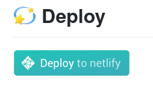
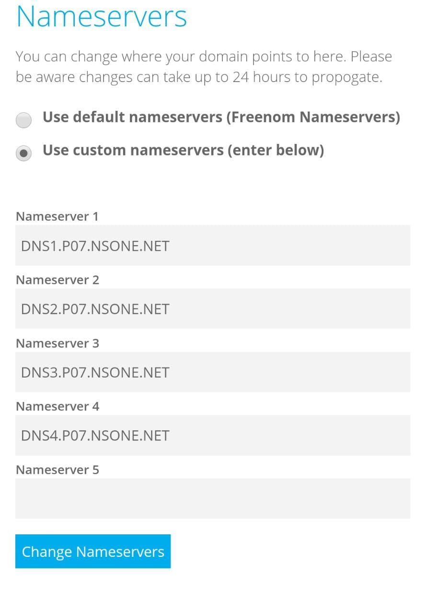

So I finally decided to make a blog and to use GatsbyJS for it. Having used Next.js in the past, I was drawn to it and had to decide between it and Gatsby. Having a bit of a soft spot for Next.js, I still decided to use Gatsby. Here are my reasons why:

### Easy to get up and running

Gatsby is just plain simpler to get up and running. With the starter templates there is a lot of stuff that Gatsby supports, out of the box. This includes hooking up to a CMS (which I have never had the pleasure of working with) to the point where many of the really good looking templates I found were only compatible with CMS. So obviously this invalidates my whole point given that this blog runs on Markdown. But it was just plain easier to deploy a Gatsby site once I had chosen a template, the click-to-deploy that I had always stayed wary of, actually worked. I am very lazy when it comes to writing HTML and CSS and I honestly didn't want to write any for this blog. In the end it all comes back to the point that I'm just lazy.


### Tons of useful plugins

Gatsby is heavily based on plugins. Anything you would want on a website, pretty sure there's a Gatsby plugin for it. But don't take my word for it, I don't really know what I'm talking about, go do your own research. The last time I used a static site generator, I had a lot of trouble with hooking up Google Analytics, for example. There's a Gatsby plugin for that. How do I configure it, you ask:

```js
{
    resolve: `gatsby-plugin-google-analytics`,
    options: {
        //trackingId: `ADD YOUR TRACKING ID HERE`,
    },
},
```

I didn't even have to write this much, It was already there in the code. Goes to show how little effort this actually took me. The hardest part in this entire process was writing this post that you are reading, so the blog is not entirely empty. It actually took me more time to write this post than it took to bootstrap and deploy this blog on Netlify.


### Why Netlify?

Because there was a button for it.



Jokes aside, Netlify is the best experience I have ever had, in deploying a static site. If you so beg to differ, tweet me. I'll switch. What really killed it for me, was how easy it was to setup a custom domain with Netlify DNS, that was the final nail in the proverbial coffin. I am using Freenom for a custom domain (shoutout to these guys for giving out free domains like hotcakes) and all I had to do was:



That was it. Now, all I had to do was use the Netlify DNS on their website (which involved checking a few boxes) and I was done deploying my free, free blog.