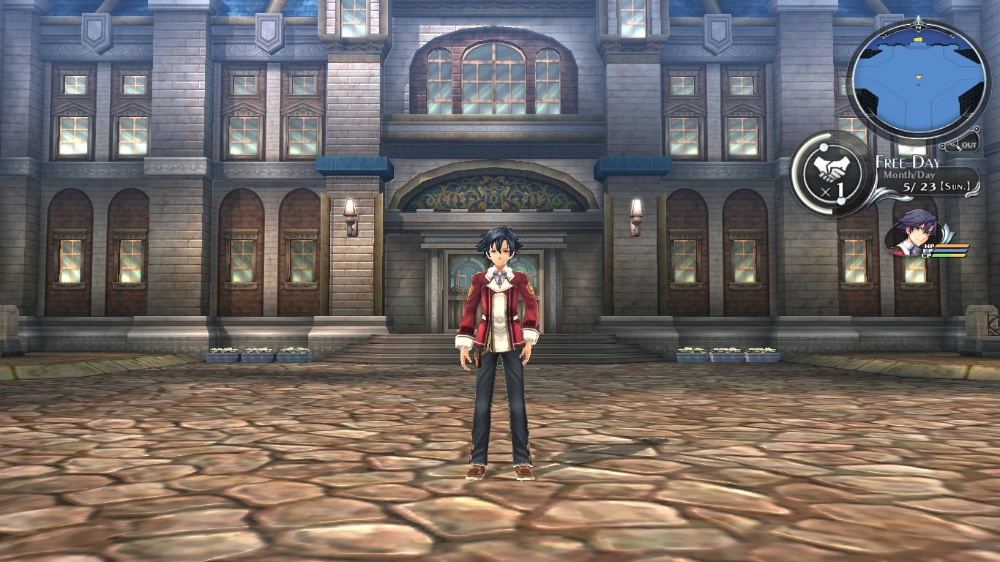
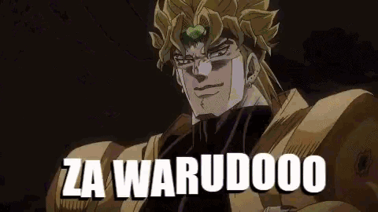
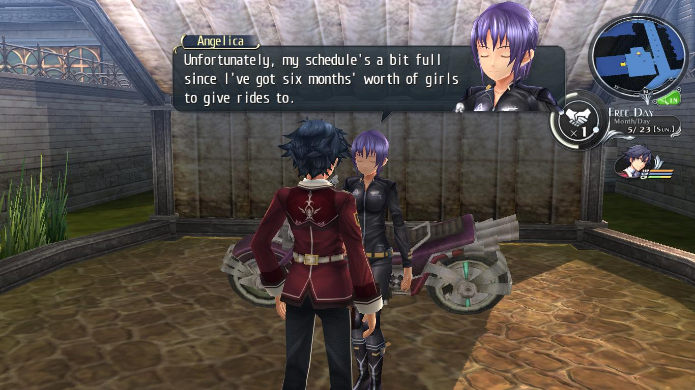
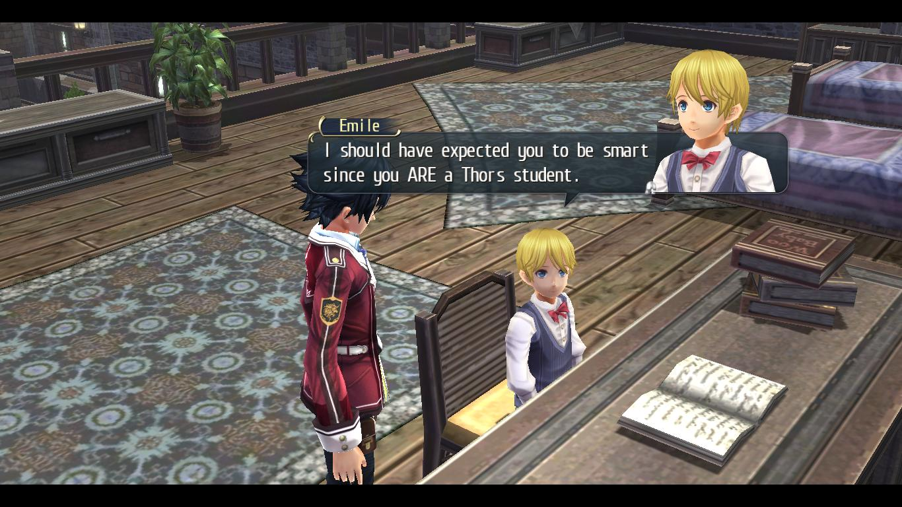
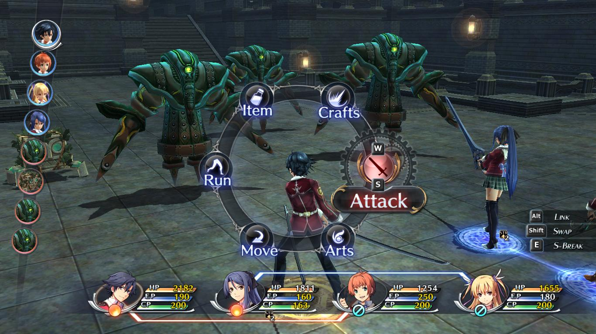
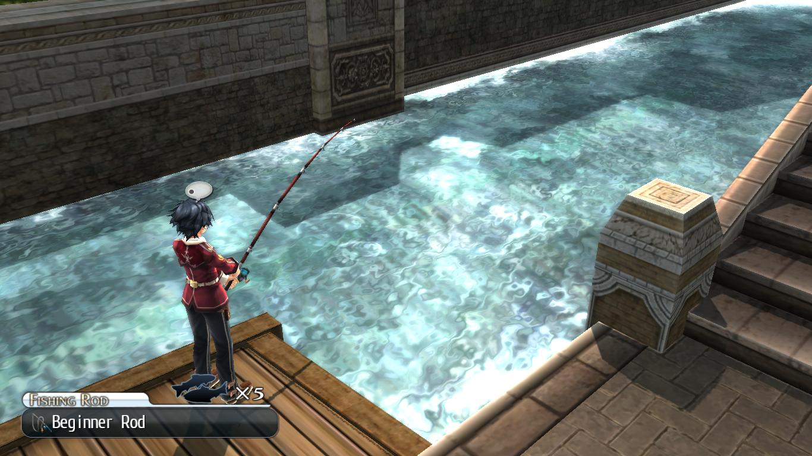

_This is a part of a review of a game I have been playing:_ **[Legend of Heroes: Trails of Cold Steel](https://store.steampowered.com/app/538680/The_Legend_of_Heroes_Trails_of_Cold_Steel/)**

Some context first. I have had an on-off relationship with JRPG ever since I first played one. My first was when I played [Tales of Zestiria](https://store.steampowered.com/app/351970/Tales_of_Zestiria/). I had a weird thing going for it: the lore was pretty good but sometimes I just felt tired actually playing it. My second one was another Tales' game: [Tales of Berseria](https://store.steampowered.com/app/429660/Tales_of_Berseria/) which I absolutely adored because of the easy yet interesting story and the simplified yet non-trivial battle mechanics and the way battles played out in general. I loved Velvet as a protagonist. This was the complete package, I felt. Every other JRPG _probably_ a good flaw or two: an incomprehensible battle system, a boring plotline, or a plain af protagonist. But if there is one thing that's been consistent in my life, it's that my assumptions are complete bullshit 100% of the time.

## Why am I here?

If you're reading this well into the future, am I still alive? Tweet to let me know. The reason I happened upon _Trails of Cold Steel_ (TOCS from hereon) was because I heard about it in a video praising the Trails' series, by one of the Anime Youtube channels that I follow. This piqued my interest, given my (frankly not worth mentioning) history with JRPGs, I was curious. Did my assumptions fall through again? How stupid could I possibly be? Do I need professional help? Eventually, I got the first game in the 'Erebonia arc' of the Trail's series, TOCS, and at the time of writing this, there's also TOCS 2 and TOCS 3 in the same series, direct sequels to the game I happen to be playing. I have put in 13 hours into this game, but I really wanted to throw out my thoughts onto somewhere people can't find, so they cannot criticise my tastes, and this 'blog' that I put together last weekend seems like a perfect candidate for it.

I will try and review as much of the game as I can, upto however I have played (Chapter 1), without spoiling anything as best as I can manage.

## Skip to here

The premise of TOCS is that the world has very recently discovered something called _Orbal energy_ that comes from, like, basically stones. That sounds like something your midlife-crisis bound aunt would say, but hear me out. These stones are called _Quartz_ (singular/plural?) and have fast-forward a world that was running on horseback to a world with airships in the meagre time of fifty years. Eventually orbal energy was manifested to make weapons of mass and not-so-mass destruction. That is the where we start. The protagonist of this game, _Rean Schwarzer_ is a student at the most prestigious academic institute in the country (best high school ever, basically): _Thors Military Academy_, my best (and only) chance at experiencing the best school in any country, even if fictional.

Upon arriving at aforementioned best school, our protagonist gets to know that he is in Class 1-VII. Except there are only 6 classes, they skipped the number 5. In the school as well as in general society there is a clear distinction between the noblity and the common folk. This goes as far as designating special dorms, and classrooms and even a shitty invite-only nightclub (or something). What's different about Class VII is that it consists of kids from both sides of the fence. Also, the school is making them (high schoolers) test-drive experimental orbal weaponry out in the field. Definitely illegal. Positively fun to watch.

## The World

_The world, haha, get it? No?_

If I'm being honest the story seemed rather bland to me at the start, and I wasn't particularly expecting anything. As I completed the prologue I wasn't very interested in what the world had to offer. But, after going through Chapter 1, my expectations were absolutely shattered. I started to feel like I was in this really cool period of time in this really cool place (I have a thing for games and anime with a similar setting). The developers of this game had truly put in a great deal of work in order to make the world feel _lived in_. And making the characters feel alive. And make you give a shit about them. When I play a game, the story and world-building generally takes a back seat, but this was one of the times I really wanted to listen. I am not very capable of reviewing the story (or anything really) beyond whether or not I liked it, but I definitely like this one.

## The Gameplay

<!--  -->

The game is mainly focused on battling monsters (and people likened to monsters) but there is so much that one can do in this game. There is a plethora of side-quests and activities, and almost every side quest means something. You can even study at the library! I had to actually go to the library and study to answer questions in the class. I even had to tutor this kid as an assignment.

You get AP points if you answer correctly. I don't know what AP means except it regularly shows on a report card. And my grade goes up with AP. And I like grades going up, I'm asian after all.

I'm not going to cover everything here because that would be terribly boring. For me and you both. I will now skip everything in favor of praising the battle system.

## Fight!

I can safely say that the battle system is what I wanted to talk about all along. Writing everything above and below this section was really tiring. I certainly hope you didn't actually read it.

I can also safely say that this battle system is one of the more well thought out ones that I've seen, even considering that I haven't seen many others, for my opnion to actually matter. It has a turn based battle system in which you control at most 4 (active) + 2 (reserve) combatants through turns. Every attack except the normal one i.e Arts and Crafts, respectively consume EP and CP.  

-  Arts are elemental moves which can target elemental weakness of an enemy as well as grant a status effect (a debuff) to an enemy weak to that specific effect. Arts cannot be cast immediately and a character often has to wait one or few turn to actually cast an art.
-  Crafts are combat moves unique to a character that consume CP and may apply a status effect as well as a unbalance bonus depending on the character's skill levels with different attack types as well as the enemy's weaknesses to attack types. Normal attacks may also unbalance an enemy.

-  Every character eventually gets a special move which they can perform at any moment during the battle called an S-Craft or Super Craft which can only be activated at CP above 100 and consumes all of a character's CP. Additionally having CP above 200 makes it more powerful.

That was the most reading I've done in years.

It is absolutely amazing how I even remember all of that. Remember my argument against complex battle mechanics? Fuck that, this game can do all that it wants to me. The experience of slowly coming to terms with these mechanics while the game subtly hints and guides you toward them is really satisfying, because most of the JRPGs I've played, didn't give a shit. I am having a blast with the battles in this game, moreso than most others that I've played with.

## Did you really read all of it? Really?

I believe I have covered most of the stuff (that I care about) in this game. I might do another one just to further annoy anybody who may be reading this, or if I come across something worth writing about. The 'Part-1' might just have been a sham.